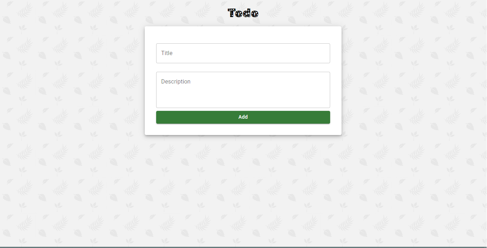
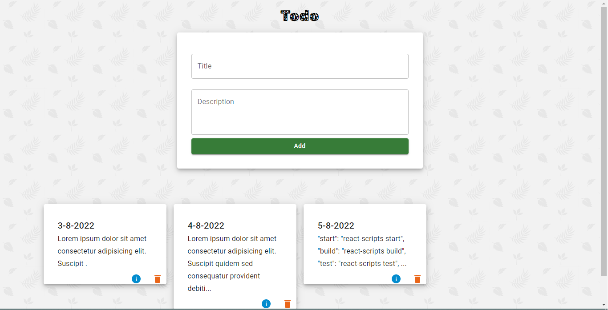
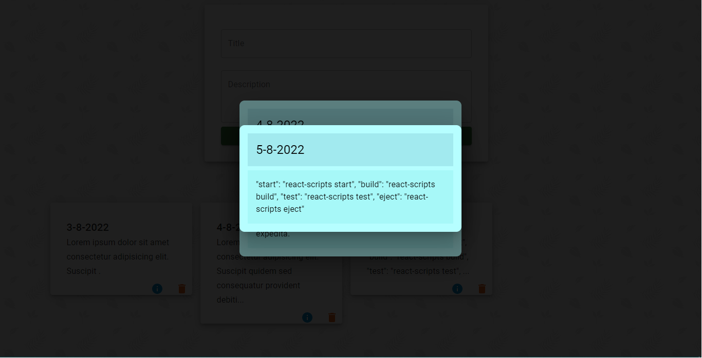
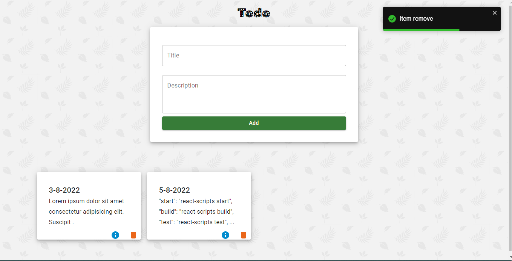

# Link 👇👇👇👇

[Deploy Link]()

**This is the Todo app. Built using React and Material UI. I used uuid to make each item unique. You can delete your to-do and click info button to get complete to-do**

```
Preview
```





